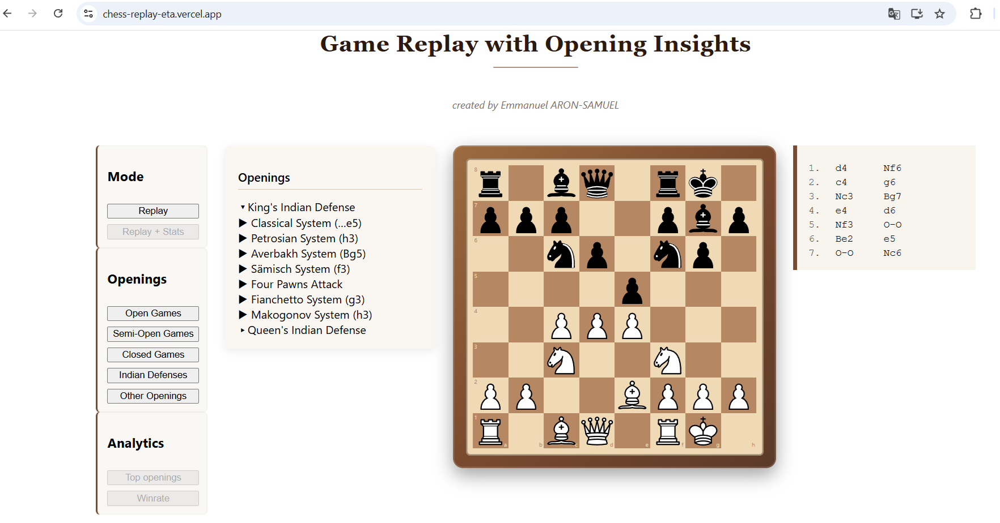
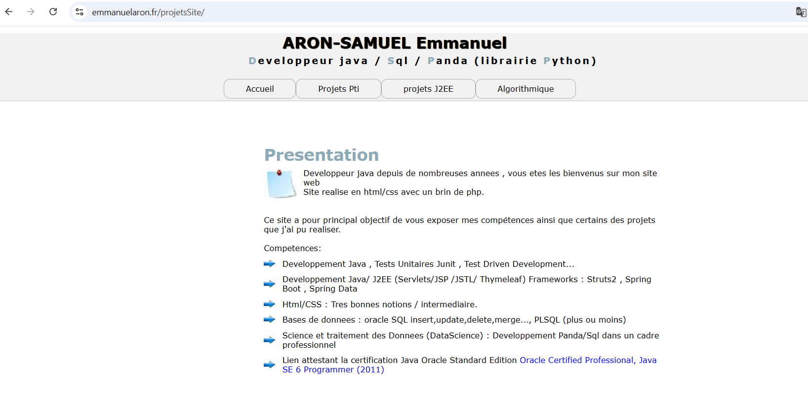

# 💻 Portfolio Java Backend – Emmanuel Aron

Bienvenue sur mon portfolio **Java Backend**.  
Ce dépôt regroupe mes projets Java/J2EE et Spring, montrant ma capacité à développer des applications backend robustes en Java, en utilisant **Jakarta EE, Servlets/JSP, Spring et déploiement sur WildFly**.

---

## 🚀 Projets phares

### Application Spring Boot , React, Kafka (en java) ,java Spark,java Websocket
- [Chess Replay](https://chess-replay-eta.vercel.app/)

- ### 📌 Description
Chess Replay est une application temps réel permettant de rejouer et visualiser des parties d’échecs via une architecture orientée événements.
Le système repose sur un backend Java Spring Boot capable de traiter des flux d’événements en continu, diffusés aux clients via WebSocket.

### ⚙️ Architecture
- Architecture event-driven
- Communication asynchrone via Kafka
- Diffusion temps réel via WebSocket
- API REST pour l’accès aux données
### 🧱 Backend
- Java 17
- Spring Boot
- WebSocket
- Apache Kafka (producer / consumer)
- MongoDB
### 🎨 Frontend
- React
- WebSocket client
- Interface dynamique pour la visualisation des parties
### 🔁 Fonctionnement
1. Les événements de jeu sont produits (Kafka Producer)
2. Ils sont consommés et traités côté backend
3. Les données sont diffusées en temps réel via WebSocket
4. Le frontend React affiche les coups dynamiquement
### 💡 Objectifs du projet
- Implémenter une architecture event-driven
- Gérer des flux temps réel
- Structurer un backend Spring Boot modulaire
- Expérimenter Kafka et WebSocket ensemble
### 🛠️ Améliorations possibles
- Authentification utilisateur
- Historique des parties
- Analyse avancée des coups (IA / stats)
---

### 🔹 Site Web – Projets Java
- [🌐 Site déployé](https://emmanuelaron.fr/projetsSite/)  

- Projet web présentant mes anciens projets java.
- Contient plusieurs mini-applications Java backend (J2EE,Struts2,Swing, Java SE,sql,diagramme Merise...) et qui sont une partie du resultat de mes anciennes formations , et ancien background en java (il y a plus de 10 ans).

---

### 🔹 Calculatrice J2EE – Partie 1 (présentation sous forme de vidéo live-coding).
- [📂 Google Drive](https://drive.google.com/file/d/1FnPrJJZ5UYgFenhu0iffi89bdGlWQ_dK/view)  
- Application de calculatrice simple en **J2EE** avec servlets et JSP.  
- Gestion des opérations de base et premières notions de MVC.  

---

### 🔹 Calculatrice J2EE – Partie 2 (présentation sous forme de vidéo live-coding).
- [📂 Google Drive](https://drive.google.com/file/d/1LXxM-z1ytM-2iDfOX5p85LGDydCo8ui9/view)  
- Évolution du projet précédent avec une architecture plus avancée.  
- Ajout de fonctionnalités et amélioration de la structure applicative.  

---

### 🔹 Cours Spring (et ses dérivés)/ Spring Boot (...)
- [📂 Repository GitHub](https://github.com/emmanuelAron/spring_cours)  
- Suivi du cours Udemy *"Bien débuter avec Spring et Spring Boot pour Java"* de Laurent Ehret.  
- Concepts abordés : **Spring Core, Spring Boot, Spring MVC, Spring Data, Spring Cloud, microservices**.  
- Mise en place de projets Spring “from scratch” pour bien comprendre l’écosystème.
- PS: les différents TP se trouvent dans des <b>branches github distinctes.</b>
  
Autres formations Spring:
- the-complete-spring-boot-development-bootcamp (Java Web Development: MVC, Beans, React (Full Stack), REST, Testing, OpenAPI, Spring Data JPA, SQL, Spring Security, JWT) : Auteur: Rayan Slim (AI Practitioner & Tech Professional)
- In 28minutes : Ranga Karanam (autre formation sur Spring et ses dérivés).
---

### Logiciel d'apprentissage des échecs
- [📂GitHub : logiciel apprentissage echecs](https://github.com/emmanuelAron/JeuEchecs)
- Ce projet committé en 2015 et réalisé avant au Greta de Champigny lors de ma formation d'un an en java et en alternance , est réalisé en java Swing.
- Le but de ce projet et d'apprendre les échecs aux jeunes enfants ou adultes via cette interface conviviale (projet visible également via mon site web:https://emmanuelaron.fr/projetsSite/ dans le menu "Pti".
- Je suis conscient des nombreuses redondances de code mais je l'ai laissé tel quel car c'est un de mes premiers vrai projets java réalisés tel quel (et sans chatGpt!).

---

### Katas exercices/projet sur la pratique du TDD (test driven development, issu du monde Agile/Clean Code)

- https://github.com/emmanuelAron/katapotter (committé en 2018)
- https://github.com/emmanuelAron/haskell_training_tdd (committé en 2017)
- https://github.com/emmanuelAron/gameOfLife (committé en 2017)

## 🎯 Objectif du portfolio

Montrer ma capacité à :  
- Développer des applications backend en **Java (J2EE / Jakarta EE / Spring)**  
- Déployer et gérer des applications sur un serveur applicatif (**WildFly**)  
- Structurer et faire évoluer des projets Java backend  
- Travailler sur des frameworks modernes (**Spring Boot, Spring Cloud, microservices**)  

---

